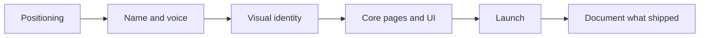

## The pattern I keep seeing

A founder in Las Vegas builds something real. Actual working product, actual paying pilot customer, usually built nights and weekends around a day job. Then they go to raise money or land their second and third customer, and everything stalls.

Not because the product is bad. Because nothing about how they present it matches how good it is.

The deck is three different fonts. The site is a template with stock photos of people pointing at whiteboards. The product UI has four shades of blue that were all "just for now." Each one is a small ask for the buyer to extend trust, and small asks add up fast.

I have seen this from both sides — eight years in corporate frontend watching brand systems get built and ignored, and now at [BLURRD studio](/services/branding) where I get called in after a launch already went sideways. The startups that avoid that call spent two or three weeks on branding before they had anything to lose.

## Las Vegas is a trust market, not an attention market

This is the part that trips up founders who moved here from a bigger tech metro.

In a market with thousands of funded startups, you are fighting for attention. Your brand has to interrupt. Here, the dynamic is different. Vegas business runs on introductions. Somebody at a Vegas Chamber mixer mentions you. A hospitality director you met at a conference forwards your name to a colleague at a different property. A construction firm in Henderson hears about you from their GC.

That means your brand almost never gets a cold first impression. It gets a warm referral followed immediately by someone opening your site in a tab to see if the referral was worth taking seriously.

So the job of branding here is not interruption. It is confirmation. Somebody already said you were good, and your site, deck, and product need to agree with them inside four seconds.

That is a very different brief than "stand out." Clarity beats cleverness. A legible name beats a made-up one. The specific thing you do should be readable above the fold, not buried under a headline about empowering transformation.

## What branding before launch actually buys you

People hear "branding" and picture a logo. The logo is maybe 15 percent of it. Here is what the other 85 percent does.

### A faster no

This sounds like a downside. It is the single most valuable output.

When your positioning is vague, everyone is a maybe. You take meetings with companies that were never going to buy, you build features for people who were never going to pay, and you burn a runway you cannot get back. When your positioning is sharp, the wrong-fit prospect self-selects out in the first thirty seconds and you get your afternoon back.

I would rather a founder tell me "we do scheduling for multi-property hospitality groups with union labor rules" and lose half their leads than say "workforce solutions for the modern enterprise" and keep all of them.

### Pricing power

Price is a story your brand tells before you say a number.

Two companies quote the same 40 thousand dollar implementation. One has a system — consistent type, real product screenshots, a case study with a name on it, an actual point of view about the industry. The other has a Canva deck. The first gets asked about timeline. The second gets asked for a discount.

The buyer is not being shallow. They are reading your polish as a proxy for whether you will still be operating in eighteen months.

### A design system your developer does not fight

This is the practical one, and why I care about branding as a developer and not just a designer.

If you hand me color tokens, type scale, spacing rules, and a defined set of components, I can build your marketing site and your app shell out of the same vocabulary. Every new page after that gets cheaper. If you hand me a logo and vibes, I invent decisions on your behalf, you disagree with half of them in review, and we pay for that twice.

I wrote more about the compounding math of this in [why design systems beat one-off pages](/blog/design-systems-beat-one-off-pages), because it is genuinely the difference between a site that gets easier to maintain and one that gets harder.

## The order I actually run it

Here is the sequence that works. Each step constrains the next instead of leaving it open.

Positioning first, because you cannot design a promise you have not written down. Voice second, because the words determine how much room the layout needs. Visual identity third, once you know whether you are selling to a casino VP or a 26 year old on a phone. Then the actual pages and screens. Then — and only then — the guidelines document, written to describe what you shipped rather than to predict it.

That last inversion matters. Most brand guideline decks get written before anything real exists, so they document intentions. The ones that stay useful describe live decisions.

## The Vegas-specific stuff nobody tells you

A few things I have only run into working with companies here.

**Your audience is often not local.** A Vegas SaaS company selling to hospitality groups is selling nationally from an address in Summerlin or the Arts District. Your brand needs to read as credible to a buyer in Dallas who has never been here. Leaning hard on neon-and-dice visual language quietly caps how seriously you get taken. I have never seen it help.

**Conference season compresses everything.** If your buyers walk trade show floors — and here a lot of them do — you have hard external deadlines. Booth graphics, a one-pager, a QR destination that is not your homepage, a demo that looks finished. Miss the date and you wait a year. Build the timeline backward from the show.

**Hospitality-adjacent buyers have unusually high visual standards.** They work inside properties that spend serious money on environment and detail. A product that looks unfinished reads as unserious to them in a way it might not to a logistics buyer. If you are selling into that world, my post on [web design mistakes Vegas hospitality businesses make](/blog/web-design-mistakes-vegas-hospitality) covers what those buyers notice and what they ignore.

## What I would do with a four-week runway

Say you launch in a month and you have limited budget. This is the sequence I would run, and I would cut scope before I cut any of these steps.

**Week one.** Write the positioning in one page. Who it is for, what it replaces, what it costs, why you. Interview three real prospects or customers and steal their language verbatim. Do not write it in marketing voice — write it in theirs.

**Week two.** Lock the visual core. One typeface family with two weights, a small palette with defined semantic roles, a logo that works at 24 pixels in a browser tab, a spacing scale. Resist expanding this — constraint is what makes output look intentional.

**Week three.** Build the three pages that matter: home, the one page that carries the pitch, and a booking page that works on a phone. Real copy, real screenshots, no lorem ipsum, no stock handshakes.

**Week four.** Pressure test it. Send it to five people who match your buyer and ask one question: what do you think we do and who is it for. If more than one gets it wrong, the problem is your positioning, not your visual design. Fix the words.

If you want AI in that loop, use it for exploration and variations, not for taste. I broke that line down in [why AI and design are a powerful combination](/blog/why-ai-and-design-are-a-powerful-combination).

## When branding first is the wrong call

I am not going to pretend it always applies.

If you have not validated that anyone wants the thing, spend nothing on identity. Go get five conversations and a signed pilot with an ugly product first. Branding amplifies whatever signal exists — if the signal is zero, you are multiplying by zero.

If your product is pre-alpha and changing weekly, a full identity is premature. A clean typeface, a defensible name, and one landing page is enough.

And if you already have traction and the brand is just dated, that is a rebrand — a different animal with real risk around SEO, existing recognition, and internal buy-in. I walked through the scope and cost of that in [what a Vegas rebrand actually includes](/blog/las-vegas-rebrand-whats-included).

## Frequently asked questions

### Should a Las Vegas startup do branding before or after building the product?

Positioning and naming go before. Visual identity runs in parallel with your first real build. What you should not do is ship to real buyers with three competing visual directions and sort it out later — you will pay to redo every asset twice.

### How much does startup branding cost in Las Vegas?

A focused pre-launch identity typically sits in the low five figures: logo system, type and color, a small component set, and the pages you need to sell. Strategy, naming, and a system that scales into product UI push it higher. Scope drives the number, not the city.

### How long does pre-launch branding take?

Two to four weeks with a decisive founder. Longer if you need naming or committee approval. The bottleneck is never production. It is decisions.

### Do I need a full brand guideline document before launch?

Enough that a developer and a marketer can both ship without messaging you. Ten to fifteen pages usually does it. Write the long version after launch.

### Does branding actually help with fundraising?

It helps with the pattern matching part. Investors form a credibility read from your deck, site, and product screenshots in seconds. Good branding will not save a weak business, but bad branding makes a strong one look a year behind where it is.

## Bottom line

Branding before launch is not about looking impressive. It is about removing every small reason a warm referral turns into a maybe.

In a referral-driven market like Las Vegas, that is most of the game. Get the positioning tight, keep the visual system small enough to hold in your head, ship three real pages, and go sell.

If you are pre-launch and want a second set of eyes on where you actually stand, [book a 15-minute call](/book-a-call). You can also see how I approach [branding in Las Vegas](/las-vegas/branding) and what a full [branding engagement](/services/branding) covers.
