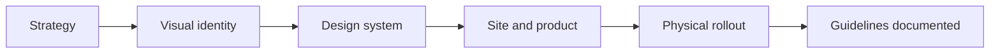

## Nobody tells you what is in the box

Every rebrand quote I have seen from the client side looks like this: a number, a timeline, and a list of words like "brand strategy" and "visual identity system." Which tells you nothing about what you are actually getting.

So when a Las Vegas company asks me what a rebrand includes, I try to answer it the way I would want it answered — as an itemized list, with the parts that quietly eat the budget called out.

This is that list.

## First, are you sure you need a rebrand

Most companies that call asking for a rebrand need something smaller. Worth checking before you spend.

**You probably need a refresh, not a rebrand, if:** people understand what you do, your name still works, and the problem is that your visual execution looks five years old. Refresh keeps the equity you built and modernizes type, color, layout, photography, and the site. Faster, cheaper, much lower risk.

**You probably need a website, not a brand project, if:** your positioning is clear and your identity is fine, but the site is slow, hides your value, or nobody can update it. That is design and engineering work.

**You actually need a rebrand if:** prospects consistently misunderstand who you serve, you have moved upmarket and your brand still reads like the older cheaper version of you, you merged or acquired, or your name has become a liability — legally, culturally, or because it describes something you no longer do.

That last category is real, but it is smaller than the number of people who ask for it.

## Phase 1: strategy and positioning

This is the part clients want to skip and the part that determines whether everything after it works.

**What is in it:**

- Stakeholder interviews, usually four to eight people internally
- Customer or prospect interviews — I want three to five, and I want to hear their actual words
- Competitive audit, focused on how competitors position rather than how they look
- Positioning statement: who you serve, what you replace, what you promise, why you
- Messaging framework: primary message, three supporting pillars, proof points
- Voice and tone guidance with real examples, not adjectives

**What it costs:** typically 20 to 30 percent of total project budget.

**Where it goes wrong:** the deliverable is a 60-page deck nobody reads. What you want is one page you can put in front of a new salesperson that changes how they talk. If the output cannot be summarized in a sentence, the strategy is not finished.

## Phase 2: visual identity

The part everyone pictures when they hear rebrand.

**What is in it:**

- Two to three distinct concept directions, presented in context rather than as logos on white
- Logo system: primary, secondary or stacked, icon or mark, and clear-space rules
- Type system: display and body families, a defined scale with named sizes
- Color: primary, secondary, and semantic roles for success, error, and warning states — not just a swatch row
- Photography and illustration direction with real examples of yes and no
- Application mockups: site, deck, product UI, and whatever physical touchpoint matters for your business

**What it costs:** usually 30 to 40 percent of total.

**Where it goes wrong:** presenting eight directions. More options do not produce a better outcome, they produce a committee compromise. Two or three sharp directions, one recommendation, and a real argument for it.

## Phase 3: the system

This is the phase most quotes underprice, and it is the one that determines whether your rebrand survives contact with reality.

**What is in it:**

- Design tokens: color, spacing, radius, type as named values a developer can implement directly
- Component library: buttons, forms, cards, navigation, tables, modals — with all their states
- Layout rules: grid, breakpoints, section patterns
- Documentation of when to use what

Skipping this is why rebrands decay. Six months later, marketing has made four buttons that are all slightly different, and the brand nobody is technically violating looks nothing like the deck. I wrote about that decay pattern in [why design systems beat one-off pages](/blog/design-systems-beat-one-off-pages).

**What it costs:** 15 to 25 percent, and worth every dollar.

## Phase 4: rollout, where Las Vegas companies get surprised

Rollout cost has almost nothing to do with design and everything to do with how many surfaces your business touches.

A software company rebrands their site, app, and deck. Done in weeks.

A Las Vegas company with physical presence has a very different list. Signage and permits. Vehicle wraps if you run a fleet. Uniforms. Printed collateral and menus. Trade show booth graphics with production lead times measured in weeks. Property signage that may need landlord or gaming-adjacent approval. Business listings, Google Business Profile, review platforms, and any directory that has your old name.

For hospitality and trades companies here, rollout is routinely the largest single line item. That is not a design cost — it is production and logistics — but it belongs in the budget conversation from day one, and it should shape your timeline. Nothing feels worse than a beautiful new identity with the old logo still on the truck for four months.

## What it actually costs

Real ranges, based on scope rather than city. Vegas pricing is not meaningfully different from other markets for this kind of work — the variables are complexity and number of surfaces.

**Refresh, small company.** Low five figures. Updated type and color, logo cleanup, small component set, refreshed core pages. Three to five weeks. Right for companies whose positioning already works.

**Full rebrand, single product or service business.** Mid five figures. Strategy, new identity, a real system, a new website. Eight to twelve weeks. This is the most common serious engagement.

**Full rebrand, multi-location or multi-product.** High five figures and up. Everything above plus sub-brand architecture, per-location content structure, and a much heavier rollout. Twelve weeks and beyond.

**What pushes it up:** naming and trademark work, more than three approval stakeholders, a product UI that also needs redesigning, physical rollout, and any migration where SEO risk is real.

**What pulls it down:** keeping your name, keeping your domain, a decisive single decision maker, and starting from an existing site whose information architecture already works.

## Protecting what you already built

The riskiest part of a rebrand is not aesthetic. It is technical and it happens at launch.

If your domain changes, you need a full redirect map and you need it before launch, not after. If URL structure changes, same. Business listings, review sites, and any place with your name and address need updating together, because inconsistent data is what tanks local search visibility.

I have seen companies lose a serious chunk of organic traffic on rebrand launch day for entirely avoidable reasons. If a platform change is bundled into your rebrand, read [why migrate from Webflow to Next.js](/blog/why-migrate-from-webflow-to-nextjs) for how the URL mapping side should be handled.

My general advice: do not combine a rebrand with a platform migration and a redesign all at once unless you have a real reason. Each one adds risk, and when something breaks you will not know which change caused it.

## Where AI fits and where it does not

People ask about this constantly now, so let me be direct.

AI is genuinely useful for the wide part of the process — exploring visual directions fast, drafting messaging variations, generating placeholder content, writing component documentation. It cuts real hours off work that used to be slow.

It is not useful for deciding. The judgment about which direction fits your buyer, which compromise to refuse, and what your brand should be willing to give up — that is the whole job, and it does not automate. I laid out where I draw that line in [why AI and design are a powerful combination](/blog/why-ai-and-design-are-a-powerful-combination).

If a vendor quotes you a rebrand suspiciously cheap and fast, you are likely buying generated options with nobody exercising taste on top. That is how you end up with an identity that looks fine and means nothing.

## Frequently asked questions

### How much does a rebrand cost in Las Vegas?

A focused refresh runs low five figures. A full rebrand with strategy, system, and a new site lands mid to high five figures. Multi-location companies go higher, mostly because of rollout.

### How long does a rebrand take?

Six to twelve weeks for the identity work. Add four to eight for a website, plus production lead times for signage or printed materials.

### What is the difference between a rebrand and a brand refresh?

A refresh modernizes execution while keeping your equity. A rebrand changes what you stand for and sometimes your name. Most companies asking for the second need the first.

### Will a rebrand hurt my search rankings?

Only if you change domains or URLs without a redirect plan. Done properly, rankings recover in weeks and often improve.

### What deliverables should I expect from a rebrand?

Positioning and messaging, a logo system with rules, type and color with defined roles, a component system, updated core pages, and guidelines a developer and marketer can both use unassisted.

### Do I need to rebrand or just a better website?

If people understand what you do, fix the website. If they consistently misunderstand who you serve, that is a brand problem.

## Bottom line

A rebrand is four things: a decision about what you stand for, a visual language that expresses it, a system that keeps it consistent, and a rollout that gets it everywhere.

Most bad rebrands underinvest in the third and forget to budget the fourth. If you are pre-launch instead of rebranding, the sequence is different and cheaper — I covered that in [why Las Vegas startups invest in branding before launch](/blog/branding-for-las-vegas-startups).

Want a scoped estimate for your situation instead of a range? [Book a 15-minute call](/book-a-call). You can also see how I run [branding in Las Vegas](/las-vegas/branding) and what a full [branding engagement](/services/branding) includes.
