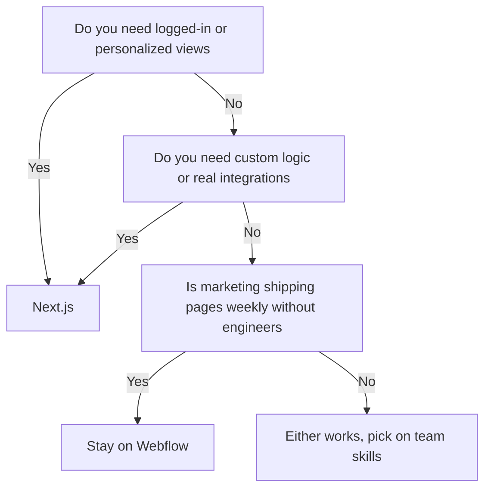

## The call I get about twice a month

A company here in Las Vegas has a Webflow site they genuinely like. Design looks good, marketing can update it, nobody is complaining about how it looks. But something new needs to happen — a customer portal, a real search experience, a pricing calculator, an integration with the system that actually runs their business — and suddenly the site is the thing standing in the way.

So they ask me whether they need to move to Next.js.

My honest answer is usually "not yet" or "yes, and it should have been six months ago," and which one depends on things that have nothing to do with the technology. Let me walk through how I actually decide.

## What Webflow is genuinely great at

I want to be clear that I am not anti-Webflow. I have built in it, I recommend it regularly, and the teams who are happiest with their website are often the ones on it.

Webflow wins when:

- **Marketing owns the site and there is no engineer to spare.** A marketer can build a landing page for a campaign on a Tuesday and have it live Tuesday afternoon. That velocity is real and it is worth a lot.
- **The site is a site.** Pages, blog, case studies, contact form, maybe a light CMS. Nothing that needs to know who the visitor is.
- **You need visual iteration.** Someone can drag a section, adjust spacing, and see it immediately without a build step or a pull request.
- **The team is small and stays small.** Fewer stakeholders means fewer conflicting edits and less need for version control.

If that describes you, migrating is a waste of money. Spend it on content and photography instead.

## What actually breaks

The problems show up in a predictable order, and they are almost never about design.

**Custom logic.** Anything conditional — show this if the user is logged in, calculate this based on three inputs, save this and come back to it later — turns into custom code embedded in a visual builder. Which means you now have a codebase, just one with worse tooling and no local development.

**Real data.** The moment your site needs to read from or write to the system that runs your business, you are gluing things together with third-party automation tools and hoping nothing times out. Every one of those glue points is a thing that will break on a Friday.

**Scale of content.** CMS collection limits, item limits, and reference limits are hard ceilings. Teams do not usually hit them, and then one day they do, mid-project.

**Performance headroom.** Webflow performance is fine out of the box and gets progressively harder to control as you add embeds, third-party scripts, and interactions. You can optimize it, but you are optimizing inside somebody else's rendering pipeline.

**Ownership.** This one only matters to some teams, but it matters a lot to those teams. Your site lives in a platform account. You can export static HTML, but not your CMS relationships or your integrations.

## Where Next.js earns it

Next.js is not automatically faster or better. It gives you control, and control is only valuable if you have something specific to do with it.

Here is what I actually get out of it on client work:

**One codebase for marketing and product.** This is the biggest one. Your logged-out marketing pages and your logged-in app share components, tokens, and type. A button change happens once. That is only possible when both live in the same repo, and it is why I push teams building a product toward this early. I broke down the compounding value of that in [why design systems beat one-off pages](/blog/design-systems-beat-one-off-pages).

**Real control over rendering.** Static generation for pages that never change, incremental regeneration for content that updates, server rendering for personalized views. You choose per route instead of accepting one strategy for everything.

**Structured data and AEO without hacks.** JSON-LD, sitemaps, canonical logic, and per-page metadata are code, so they are testable and consistent. That matters more every year as AI assistants become a real traffic source and they need clean, parseable structure.

**Integrations as first-class code.** Payments, CRM, auth, internal APIs — all normal server-side work instead of embedded scripts and automation duct tape.

**Cost predictability at scale.** Hosting a static-first Next.js site is inexpensive, and it does not get more expensive because you added CMS items or another editor seat.

I went deeper on the migration mechanics in [why migrate from Webflow to Next.js](/blog/why-migrate-from-webflow-to-nextjs) if you want the URL mapping and SEO preservation details.

## How Las Vegas companies specifically hit this wall

A few patterns I see repeatedly with clients here, because of the industry mix in this city.

**Hospitality tech and gaming vendors sell to enterprise buyers.** Casino operators, resort groups, and their procurement teams ask security and integration questions that a Webflow site cannot answer. Once you need SSO, a customer portal, or a documented API, you need a real application. The marketing site usually ends up migrating just so it lives next to the product.

**Construction, HVAC, and trades companies scale into operations tools.** A Henderson contractor with a nice brochure site suddenly wants job status lookup for clients, or a subcontractor portal. That is application work.

**Conference-driven businesses need speed and flexibility on hard deadlines.** If your buyers are walking a trade show floor, you need a campaign landing page, a gated demo request, and analytics that connect to your CRM — built fast, and reliably. Either tool can do that page. Only one of them lets you also gate content by account.

**Local service businesses genuinely should stay put.** A med spa, a law firm, a restaurant group — if the site's job is to convert local search traffic into calls and bookings, Webflow is often the right answer and I will tell you that on the call. The related problems there are usually design and speed, not platform. I covered those in [web design mistakes Vegas hospitality businesses make](/blog/web-design-mistakes-vegas-hospitality).

## The decision, as a flowchart

This is roughly the logic I run through when someone asks.

Notice that none of the branches are about design quality or how modern the stack feels. If your only reason to migrate is that Next.js sounds more legitimate, that is not a reason.

## What the migration actually looks like

If you do decide to move, here is the honest scope so nobody gets surprised.

**Week one: audit and map.** Every URL, every redirect, every form destination, every third-party script. This is the unglamorous work that determines whether your traffic survives. Skipping it is how companies lose 40 percent of organic traffic overnight.

**Weeks two and three: rebuild the system, not the pages.** You are not recreating 30 pages by hand. You are building the 12 to 15 section components those pages are made of, then composing pages from them. If the rebuild feels like it is taking forever, it is usually because someone is building pages instead of components.

**Week three or four: content migration.** Blog posts, case studies, team bios into markdown or a headless CMS. This is scriptable and usually faster than people expect.

**Week four or five: parity check and redirects.** Side-by-side comparison on real devices, redirect testing, metadata verification, sitemap submission. Then launch.

Design is often the smallest part, because you are usually keeping the look you already paid for. That is worth saying out loud — a migration is not a redesign, and combining them doubles your risk surface.

## What I would tell you if we were on a call

Three questions, and your answers basically decide it.

**Are you shipping a product, or just a site?** Product means one codebase. That is not really a debate.

**Who edits content, and how often?** If the answer is "our marketing lead, several times a week, and she is not technical," you need a headless CMS with a genuinely good editing experience, and you need to budget for setting that up properly. Do not hand a marketer a Git workflow and call it done.

**What is currently painful?** If nothing is, do not migrate. If the answer is "we pay a developer every month to maintain custom embeds," you are already paying for a codebase without getting the benefits of one.

## Frequently asked questions

### Is Next.js better than Webflow?

No — they are good at different things. Webflow is better for marketing autonomy on a content site. Next.js is better once you need logic, data, or a shared system with a product.

### When should a company migrate from Webflow to Next.js?

When you are fighting the tool instead of using it. Auth, real search, per-user data, collection limits, or paying for ongoing workarounds are all clear signals.

### Will migrating from Webflow to Next.js hurt my SEO?

Not if you map redirects first. Keep URLs identical where possible, 301 the rest, preserve metadata, ship a sitemap at launch. Faster load times usually help rankings after the move.

### How long does a Webflow to Next.js migration take?

Three to six weeks for a typical marketing site. Longer with heavy CMS content, ecommerce, or integrations that need rebuilding.

### Can non-technical marketers still edit a Next.js site?

Yes, through a headless CMS. You lose the drag-and-drop canvas, which is a real tradeoff worth naming before you commit.

### How much does a Next.js rebuild cost compared to staying on Webflow?

The rebuild is a larger one-time investment, typically mid five figures for a real marketing site. Hosting is usually cheaper afterward, and you stop paying to maintain workarounds.

## Bottom line

Pick the tool that matches what you are building next, not what you built last year.

If your site is a site, Webflow is a fine place to stay and I would rather you spend the money on content. If your site is turning into software, move before the workarounds calcify — migrations get more expensive the longer you wait, because there is more custom glue to unwind.

If you want a straight read on which side of that line you are on, [book a 15-minute call](/book-a-call). You can also see how I approach [development in Las Vegas](/las-vegas/development) and what a full [development engagement](/services/development) covers.
