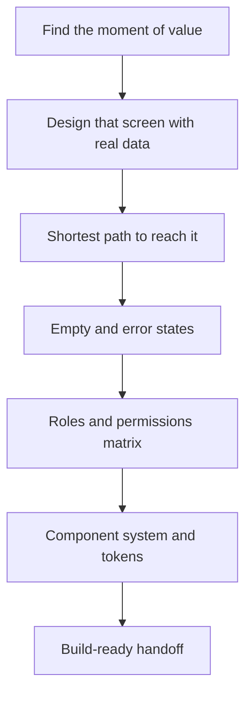

## Vegas has more real tech companies than people assume

Not the version you read about in national coverage. Real ones — hospitality management platforms, gaming systems vendors, fintech, logistics tools, construction software, esports infrastructure, med-tech. Small teams with paying customers, usually selling to enterprise buyers who run large physical operations.

I have spent eight years in corporate frontend and the last few doing product work at [BLURRD studio](/services/design), and the design problems I see in Las Vegas SaaS are consistent enough that I can usually guess them before the screen share starts.

Here is what I actually prioritize, in order, and why.

## Design the moment of value, not the dashboard

Almost every early SaaS team designs the dashboard first. It feels like the center of the product, so it gets the attention.

But the dashboard is not where your user decides whether your product is worth their time. That happens on one specific screen — the moment they see the thing only your product can show them. The schedule that finally resolves conflicts. The report that took four hours in Excel. The alert that would have cost them money.

Design that screen first, in high fidelity, with real data. Then work backward to the shortest path to reach it, and outward to everything else.

Design the dashboard first and you end up optimizing a navigation surface for a value you have not defined yet. I have seen teams spend six weeks on a dashboard nobody looks at twice while the screen that actually sells the product stayed a rough table with default styling.

## Empty states are your real first impression

Every single new user starts with no data.

So the emptiest, least impressive version of your product is the first one anyone experiences. And in most products I audit, the empty state is either a blank rectangle, a spinner that never resolves, or the word "No results" in gray text.

A good empty state does three things: explains what will appear here, says exactly what to do to make that happen, and gives a one-click way to do it. Sample data or a template counts. Anything beats a void.

This is the highest-leverage UX fix in most early products and it is usually a day of work. It also gets cut first because it feels like polish. It is not polish — it is the onboarding.

## Enterprise buyers judge your UI as a risk signal

Here is where the Las Vegas market specifically shapes the design brief.

A huge share of tech companies here sell into large physical operations — casino and resort groups, property management companies, large construction firms, healthcare systems. Those buyers have procurement processes, security reviews, and multiple stakeholders who all have to not object.

In that room, your UI is doing something other than helping users. It is being read as evidence. Inconsistent spacing and four shades of blue do not register as design opinions — they register as "this team might not have their engineering discipline together." Fair or not, that judgment gets made.

There is a second dynamic specific to this city: your buyers work inside environments where visual detail is taken seriously. A resort group spends real money on how a lobby feels. Their tolerance for a product that looks unfinished is lower than a logistics buyer's, because they think about presentation professionally.

Practically, that means a few things get outsized value:

- **Consistency over creativity.** Same spacing, same states, same patterns everywhere. Boring and consistent beats interesting and varied.
- **Real screenshots in sales materials.** Not illustrations of a product — the actual product, with plausible data, no "Test User 1."
- **Density that respects their work.** Enterprise operators want more on screen, not less. Airy consumer layouts read as toy-like to someone managing 400 rooms.

## Role-based UI is where scope explodes

Almost every B2B product here has roles. Admin, manager, staff, sometimes external vendor or client access.

The mistake is treating roles as an implementation detail for later. What happens instead is the developer hits an ambiguous case at build time, makes a reasonable guess, and now a manager sees something they should not — or the interface shows a control that errors when clicked.

Design roles explicitly. For every screen, define what each role sees, what is visible but read-only, and what is hidden entirely. Hidden versus disabled is a real decision with real consequences: disabled tells the user a capability exists and they lack it, hidden pretends it does not exist. Both are correct in different situations, and somebody should decide on purpose.

Write those states into your component specs. It is unglamorous documentation work that saves an enormous amount of build-time back and forth.

## Build a system, not screens

If your product has more than about fifteen screens, designing screens individually stops working.

You need the vocabulary: type scale, spacing scale, color with semantic roles, and components with every state defined — default, hover, focus, active, disabled, loading, error, and empty. Once that exists, new screens are assembly instead of invention, and they take hours instead of days.

The version of this that actually matters is when your marketing site and your product share the same tokens. One design language, one place to change a color, no situation where your homepage and your app look like different companies. That is much easier when both live in the same codebase, which is part of why I push product teams toward that setup — I compared the options in [Next.js vs Webflow for Vegas companies](/blog/nextjs-vs-webflow-las-vegas), and the full argument for systems over pages is in [why design systems beat one-off pages](/blog/design-systems-beat-one-off-pages).

## The flow I run for a product design engagement

Notice that handoff is last and the system is second to last. Both come after the product decisions are made, because building a component library before you know what the product does is how you end up with 40 beautiful components and no working flow.

## States are most of the work

Designers show the happy path because the happy path demos well. Then engineering builds it and discovers the product spends a lot of its life not in the happy path.

For every meaningful screen, I want these defined before anyone writes code:

- **Loading.** Skeleton or spinner, and what happens if it takes eight seconds
- **Empty.** Covered above, and it applies to every list and table, not just the first one
- **Partial.** Some data loaded, some failed — extremely common with multiple API calls
- **Error.** Specific and actionable. "Something went wrong" is not a design, it is a shrug
- **Permission denied.** What the user sees when their role blocks them
- **Too much data.** What a table looks like with 10,000 rows, because someone will have 10,000 rows

That list is not exciting to design. It is also the difference between a product that feels solid and one that feels like a demo, and users form that impression within a few minutes.

## Where AI helps in product design

Since everybody asks: I use it daily, and it is genuinely great at specific parts of this.

Generating variations of a layout so I have options to react to. Drafting microcopy for empty states and error messages, which I then rewrite. Producing first-pass component documentation. Summarizing responsive behavior for handoff. All real time savings on work that used to be slow and tedious.

What it does not do is decide which layout serves a resort operations manager better, or know that this particular error message needs to say what to do next rather than what went wrong. That judgment is the actual job. I wrote up how I split that in [why AI and design are a powerful combination](/blog/why-ai-and-design-are-a-powerful-combination).

## What I would fix first with limited budget

If you have one sprint of design time and an existing product, this is the order I would go.

**One.** Fix the empty states on your three most-used screens. Cheapest real UX win available.

**Two.** Fix error messages so each one says what happened and what to do. Almost no design cost, immediate support ticket reduction.

**Three.** Unify spacing and type across your main flow. Not a redesign — pick the scale you already mostly use and enforce it. This is what makes a demo look intentional.

**Four.** Redesign the single screen where your value lives, with real data. Then screenshot it for sales.

**Five.** Now build the component system, documenting what you just standardized rather than predicting it.

That sequence gets you visible improvement in weeks instead of a three-month redesign that lands all at once and risks breaking things users already learned.

## Frequently asked questions

### What should a SaaS product design first?

The screen where your user gets value, and the shortest path to it. Dashboard and settings come after.

### How much does SaaS UI/UX design cost?

Low five figures for a focused flow redesign. Mid five figures and up for a full engagement with a component system, multiple flows, and build-ready handoff.

### Do B2B SaaS products need to look good, or is function enough?

Function first, but in enterprise procurement your UI gets read as a proxy for engineering discipline. Polish is a trust signal at that table.

### How do you design for role-based permissions without building four separate products?

One interface, explicit definitions of what each role sees, what is read-only, and what is hidden. Document it in your component specs.

### What is the most common UX mistake in early SaaS products?

Leaving empty states undesigned. Every new user starts there, so it is your actual first impression.

### Should SaaS design and development be handled by the same team?

It helps. Designers who know what is expensive to build produce fewer impossible specs, and you get less rework.

## Bottom line

Good product UX is not about being clever. It is about designing the moment your product proves itself, then handling every unglamorous state around it — empty, loading, denied, broken, overloaded.

For Las Vegas companies selling into enterprise operators, consistency and polish are doing a second job as credibility. That is worth budgeting for.

If you want a read on where your product's UX is costing you conversions or support load, [book a 15-minute call](/book-a-call). You can also see how I approach [design in Las Vegas](/las-vegas/design) and what a full [design engagement](/services/design) covers.
