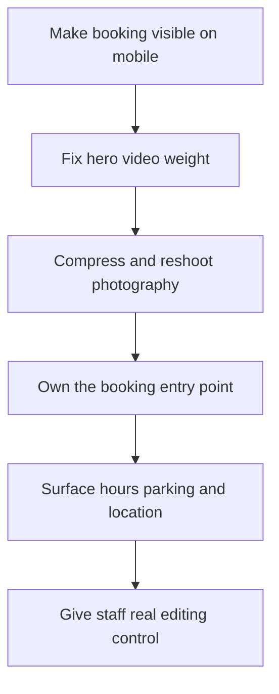

## I keep auditing the same website

Different logo, different cuisine, different property. Same six problems.

Over the last couple years I have looked at a lot of Las Vegas hospitality sites — restaurant groups, event venues, nightlife, tour operators, off-Strip spots in Henderson and the Arts District that do great business in person and then throw half of it away online.

The frustrating part is that none of these are hard problems. Most are one afternoon of work each, and they compound directly into bookings.

Here is the list, in the order I would fix them.

## Mistake 1: the booking action is below the fold

This is the big one and it is everywhere.

Someone is standing on Fremont Street with 12 percent battery deciding where to eat. They tap your link. They get a full-screen hero video, a logo, and a headline about culinary journeys. The reserve button is three scrolls down or hidden behind a hamburger menu.

That person is not going to hunt. They are going to hit back and tap the next result.

Your homepage has one job on mobile, and it is not ambiance. Ambiance is what the photography does while people do the thing they came for. Put the primary action in the first viewport — reserve, buy tickets, view menu, whatever your money action is — and make it a real button, not a text link in a nav.

**The fix:** one visible primary action above the fold on mobile. One. If you have two equally important actions, you have not decided which matters, and your visitor will not decide for you.

## Mistake 2: the hero video is destroying your load time

I have opened Vegas hospitality sites where the hero video was over 40 megabytes. Autoplaying. On mobile. Over cellular.

That video loads before your booking button becomes tappable. So the person who wanted to reserve is staring at a blank rectangle for six seconds while your beautiful b-roll of a cocktail being poured downloads.

I get why it happens. The video is genuinely great — somebody paid a real crew for it, and it feels wrong to hide it. But it is sitting in the exact spot where speed matters most.

**The fix, in order of how much I like it:**

- Compressed poster image first, video loads only after the page is interactive
- Video moved further down the page, below the booking area, lazy loaded
- Video swapped for a still on mobile entirely, kept on desktop where bandwidth is friendlier
- Keep the autoplay hero, but get it under 3 megabytes with a proper encode

Any of those beats what most sites are doing now.

## Mistake 3: photography that is beautiful and useless

Vegas hospitality has the opposite of a photography problem. The shoots are gorgeous. The issue is what got shot.

I see 20 atmospheric shots of empty dining rooms at golden hour and zero photos of the food a person is deciding whether to order. Wide architectural shots of the venue, nothing showing what a table looks like or how the room feels when it is full.

People browsing hospitality sites are making one prediction: what will this be like when I am there. Empty rooms do not answer that. Neither does a stock photo of a couple laughing, which all of us spot instantly.

**The fix:** shoot the thing people are buying. Real plates, real crowd, real bar at 10pm. And compress it — a 4 megabyte hero JPEG is a design decision whether you meant it or not.

## Mistake 4: the reservation widget owns your first impression

Almost every hospitality site hands the actual transaction to a third-party platform, and that is correct. You do not want to build inventory management, payment processing, and cancellation policy logic yourself.

What goes wrong is letting that embed dictate your experience. The widget script blocks rendering, the iframe has its own fonts and colors that clash with everything, and the flow drops the user onto a page that looks like a different company.

**The fix:** keep the third-party system for the transaction, but own the entry point. Style your own button, load the widget script after the page is interactive, and if the platform offers a theming API or a redirect flow with custom branding, use it. The user should never feel like they got handed off to a stranger mid-purchase.

This is one of the places where having a real component system pays off — you define the button and modal once and every location page inherits it. I got into why that matters in [why design systems beat one-off pages](/blog/design-systems-beat-one-off-pages).

## Mistake 5: hours, location, and parking are hard to find

This is the least glamorous item on the list and probably the highest ROI.

An enormous share of hospitality traffic is not browsing. It is people who already decided to come and need one piece of operational information: are you open right now, where exactly do I park, is there a dress code, do you take walk-ins.

In Las Vegas the parking question is not a small detail. "Inside the resort" means something very different to a local than a tourist, and self-park versus valet versus which garage entrance genuinely confuses visitors. If they cannot answer it in ten seconds, they call — so somebody on your team is answering the phone instead of running service.

**The fix:** hours, address, and parking guidance in the footer of every page and on a dedicated page that ranks. Write the parking instructions like you are texting a friend, not like a legal disclaimer. Add structured data so Google can surface it directly.

## Why this hits Las Vegas businesses harder

A few dynamics make these mistakes more expensive here than they would be in most cities.

**Decision windows are tiny.** A tourist picking dinner decides in a two-minute window, standing up, on a phone, with three other people looking over their shoulder. No research phase, no bookmarking, no coming back tomorrow. You convert in that window or you do not exist.

**Traffic is overwhelmingly mobile and new.** Most local businesses get returning visitors who know the site. Vegas hospitality skews hard toward first-timers on phones on hotel wifi. Every session is a cold start, so every friction point gets paid in full.

**You are competing with aggregators, not just other venues.** OpenTable, Yelp, Vegas.com, and hotel concierge apps all sit between you and the customer. If your own site is slower and clunkier than the aggregator listing, you are paying a commission for traffic you could have owned.

**Seasonality is violent.** Conference weeks, fight weekends, F1. Traffic can go up 10x in a day, and a site that is slow at normal volume becomes unusable at peak — exactly when bookings are worth the most.

## Mistake 6: the site cannot keep up with operations

Here is the one nobody frames as a design problem, but it is.

Hospitality changes constantly. Menus rotate. A holiday prix fixe launches. A DJ gets announced Thursday for Saturday. Happy hour moves an hour earlier. If updating any of that requires emailing an agency and waiting three days, your site is permanently out of date — and an out-of-date site is worse than an ugly one, because it actively misinforms people.

I have seen sites still promoting an event that happened two months ago because nobody on staff could edit it.

**The fix:** whoever runs the venue needs to change hours, menus, and event listings themselves, in under five minutes, from a phone. That is a content architecture decision made during design, not a feature bolted on later. Define what is editable, keep those fields simple, and do not build layouts that break when a menu item has a long name.

If your current setup makes that painful, that is often the real trigger for a platform change rather than a visual redesign. I compared the tradeoffs in [Next.js vs Webflow for Vegas companies](/blog/nextjs-vs-webflow-las-vegas) and in [why migrate from Webflow to Next.js](/blog/why-migrate-from-webflow-to-nextjs).

## The order I would fix them

If you only have budget for part of this, sequence matters. Cheapest and highest impact first.

The first two are usually a day of work combined, and they move mobile conversion more than a full redesign would. Start there before anyone opens Figma.

## Frequently asked questions

### What is the most common web design mistake Las Vegas hospitality businesses make?

Burying the booking action. Traffic arrives on a phone with a single intent, and if the action is not in the first viewport, you lose people who were already sold.

### How fast should a Las Vegas restaurant or venue website load?

Under 2.5 seconds for the largest visible element, measured on a mid-tier phone over cellular — not on your laptop over office wifi. Most sites I audit are between 5 and 9 seconds.

### Do hospitality sites need a video hero?

Not the way it is usually built. Lead with a compressed poster image, load video after the page is interactive, and consider dropping it on mobile entirely.

### Should I use a third-party reservation widget or build my own booking flow?

Use the third party for the transaction. Own the button, the styling, and when the script loads. Do not let the embed define your first impression.

### How do I know if my hospitality website is actually losing bookings?

Compare mobile conversion to desktop. If mobile is most of your traffic but a small minority of your bookings, the gap is design and speed.

### How much does a hospitality website redesign cost?

A single venue usually lands in the mid five figures. Multi-property groups run higher, because the work is in the shared system and the multiple reservation integrations, not the page count.

## Bottom line

None of this is about making your site prettier. Vegas hospitality sites are usually already pretty. They are slow, they hide the action, and they cannot be updated by the people who run the business.

Fix those three things and the design you already paid for finally gets to do its job.

If you want a straight read on where your site is leaking bookings, [book a 15-minute call](/book-a-call) — I will pull it up on a phone and tell you what I see. You can also look at how I handle [design in Las Vegas](/las-vegas/design) and what a full [design engagement](/services/design) includes.
